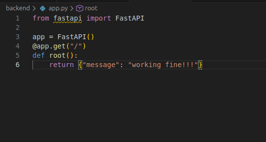

<<<<<<< HEAD

# BACKEND REPORT - Week 1 
**Project: GROF**  
**Team T4: Backend & Data Pipeline**
---------------------------------------------
### Objective of the week 
#### The goal for week 1 was to set up the entire backend infrastructure for the project, including containerization, database configuration and service networking.
--------------------------------------
### Deliverables
1. ***Backend Environment Setup*** :  
    A clean backend project structure was created :  
    backend/  
    │── api/  
    │── models/  
    │── app.py  
    │── Dockerfile  
    │── requirements.txt  
    │── docker-compose.yml

2. ***Minimal FastAPI Application***  
Implemented a basic FastAPI endpoint to verify that the backend container runs correctly:     
   
This confirms that the backend starts successfully inside Docker. 
3. **Full containerization ( Docker & Docker compose )**  
    A multi-container setup was created using docker compose containing:

    **FastAPI Backend Container**
    - Built using a custom Dockerfile and based on Python 3.10 Alpine image  
    - Runs FastAPI via Uvicorn  

    **Database Container (PostgreSQL)**
    - Auto-created database, user and password  
    - Uses a persistent docker volume so data survives restarts  

    **PgAdmin Container (Database UI)**
    - Accessible via localhost:5050  
    - Allows inspection of the PostgreSQL database  

    **Internal Docker Network**  
    All containers communicate internally. The backend accesses the database using  
    the connection string: **postgres://admin:admin@db:5432/grof**

4. **Validation & Testing**   
    **docker compose up --build**   
    This confirms the backend environment and container architecture are fully operational.
5. **Outcome of week 1**
    - Fully containerized backend system
    - Clean and scalable backend folder structure
    - Working API endpoint
    - Functional PostgreSQL database container
    - Database UI via PgAdmin
    - Robust internal networking between services

---------------------------------------------


# BACKEND REPORT – Week 2 & Week 3


---------------------------------------------

## Week 2 – Advanced Data Modeling & Database Migrations

### Objective of the week
The goal for Week 2 was to design and implement a scalable database schema for profiling data and to introduce structured database migrations using Alembic. The focus was on handling high-frequency CPU/GPU profiling data efficiently while avoiding unnecessary data duplication.

---------------------------------------------

### Deliverables

#### 1. Database Schema Design
A relational database schema was designed to represent profiling sessions and their associated data.

The following core entities were implemented:

**Session**
- Represents a profiling run
- Stores metadata about the execution
- Fields include:
  - `id`
  - `name`
  - `start_time`
  - `end_time`
  - `git_commit_hash`
  - `tags`

**CpuSample**
- Represents a single CPU profiling sample
- Designed for very high ingestion rates
- Fields include:
  - `session_id` (foreign key)
  - `timestamp` (stored in nanoseconds)
  - `thread_id`
  - `stack_hash`

**StackFrame**
- Stores unique stack frames using hashing to avoid duplicated strings
- Fields include:
  - `hash`
  - `function_name`
  - `file_path`

**GpuEvent**
- Schema prepared for GPU kernel execution events
- Fields include:
  - `session_id`
  - `name`
  - `start_time`
  - `end_time`
  - `stream_id`

---------------------------------------------

#### 2. SQLAlchemy ORM Integration
- All tables were implemented using SQLAlchemy ORM
- Foreign-key relationships were defined between sessions, CPU samples, and stack frames
- Models were organized under `app/models` to keep a clean and maintainable structure
- The schema supports efficient joins and future aggregation queries

---------------------------------------------

#### 3. Alembic Migration Setup
- Alembic was configured to manage database schema changes
- All tables were created using migrations instead of manual SQL
- This ensures reproducibility and safe schema evolution during development

---------------------------------------------

#### 4. Outcome of Week 2
- Well-structured relational schema for profiling data
- Reduced storage overhead using stack frame hashing
- ORM-based database access layer
- Migration-based schema management
- Backend ready for large-scale data ingestion

---------------------------------------------

## Week 3 – API Logic & Data Ingestion

### Objective of the week
The goal for Week 3 was to implement backend API logic for ingesting profiling data and to validate the full data pipeline from API request to database persistence. The focus was on CPU sample ingestion as a foundation for later aggregation and visualization.

---------------------------------------------

### Deliverables

#### 1. CPU Sample Ingestion Endpoint
A high-level ingestion endpoint was implemented:

This endpoint:
- Retrieves all CPU samples associated with a session
- Confirms successful data persistence
- Supports debugging and validation of ingestion logic

---------------------------------------------

#### 3. End-to-End Pipeline Validation
The full backend data pipeline was validated:

**API Request → FastAPI → SQLAlchemy ORM → PostgreSQL → API Response**

Successful validation confirmed:
- Correct database writes
- Correct foreign-key relationships
- Stable containerized execution

Example response:
```json
{
  "session_id": 2,
  "count": 2,
  "samples": [
    {
      "id": 9,
      "timestamp": 1230000000,
      "thread_id": 0,
      "stack_hash": "..."
    }
  ]
}

---------------------------------------------
### 4. Outcome of Week 3
- Functional batch ingestion for CPU profiling data  
- Verified persistence of CPU samples in PostgreSQL  
- Stable and tested API endpoints for data ingestion and retrieval  
- Backend prepared for aggregation logic and flamegraph generation  

---------------------------------------------
### Status After Week 3
- Backend infrastructure fully operational  
- Database schema implemented and validated  
- CPU data ingestion pipeline working end-to-end  
- System ready for aggregation logic and visualization support  
---------------------------------------------


🔹 Milestone 1 — Week 4
Session Management & Backend Integration
🎯 Objective

Introduce explicit profiling session lifecycle management and validate backend aggregation logic before frontend integration.

✅ Implemented Features
1️⃣ Session Control Endpoints

Implemented dedicated session lifecycle endpoints:

POST /sessions/start
POST /sessions/stop


Behavior:

POST /start

Creates a new profiling session

Records start timestamp

Returns a unique session_id

POST /stop

Finalizes the session

Records end timestamp

Computes session duration

📌 These endpoints define clear profiling boundaries required for correlation and comparison.

2️⃣ Run Management & Metadata

Implemented backend support to list past profiling sessions, including:

Session duration

Total GPU execution time

Session identifiers

Metadata required for frontend selection and comparison

This directly enabled:

Frontend session dashboard

Comparison mode in Milestone 2

3️⃣ Backend Integration Testing

To ensure correctness and stability, I implemented integration tests using pytest.

Testing approach:

Spin up a real database instance

Insert synthetic CPU and GPU profiling data

Execute aggregation logic

Verify:

Correct construction of CPU call trees

Correct aggregation of metrics

Stable behavior under realistic workloads

📌 This validated backend aggregation logic before exposing it to the frontend.

🔹 Milestone 2 — Week 1
Correlation Data Model & Ingestion
🎯 Objective

Design and implement the backend foundations required for CPU–GPU correlation.

✅ Implemented Features
1️⃣ Correlation Data Model

Extended the database schema with explicit correlation support.

New entity: CorrelationEvent

Conceptual structure:

CorrelationEvent(
  id,
  session_id,
  correlation_id,
  cpu_timestamp,
  cpu_stack_hash,
  gpu_kernel_id (resolved later)
)


Purpose:

Store CPU-side correlation points

Enable later matching with GPU kernels

2️⃣ GPU Event Extension

Extended GpuEvent to include:

correlation_id

This allows GPU kernels (from CUPTI) to be linked back to CPU execution context.

3️⃣ Dual Ingestion Endpoints

Implemented independent ingestion paths for CPU and GPU profilers:

CPU-side (eBPF):

POST /sessions/{id}/cpu-correlation


GPU-side (CUPTI):

POST /sessions/{id}/gpu-events


📌 CPU and GPU ingestion are decoupled, asynchronous, and order-independent.

4️⃣ Batch Ingestion for Performance

To ensure scalability, I implemented bulk insert logic:

Multiple events inserted per query

Avoided per-row inserts

This is required to support real profiling workloads with thousands of events.

🔹 Milestone 2 — Week 2
Correlation Engine & Clock Synchronization
🎯 Objective

Automatically match CPU stacks with GPU kernels and align their timelines.

✅ Implemented / Designed Features
1️⃣ Correlation Engine (Post-Ingestion)

Designed a background correlation process:

For each session:

Load all CorrelationEvent records

Load all GpuEvent records with correlation_id

Match CPU and GPU events by correlation_id

Link CPU stack → GPU kernel

📌 Correlation is done after ingestion to keep ingestion fast and robust.

2️⃣ Correlation Output Strategy

Two backend representations were prepared:

Join table (CpuGpuCorrelation)

Materialized view for read-heavy frontend usage

The frontend was designed to consume either representation.

3️⃣ Clock Synchronization (Critical)

Problem:

CPU timestamps (eBPF) and GPU timestamps (CUPTI) use different clocks

Solution:

Create a synchronization point at profiling start:

cudaEventCreate(...)
cudaEventRecord(...)


Capture:

CPU host timestamp

GPU device timestamp

Compute and store offset:

gpu_time ≈ cpu_time + offset


This enables correct temporal alignment of CPU and GPU timelines.

4️⃣ Validation Strategy

Validated correlation logic using a minimal PyTorch workload:

torch.matmul(...)


Expected:

CPU stack captured via eBPF

GPU kernel (sgemm) captured via CUPTI

Matching correlation_id

Correct time alignment

This confirmed:

Correlation correctness

Clock synchronization accuracy

🏁 Summary of My Backend Contributions

✅ Session lifecycle management (M1 Week 4)
✅ Backend aggregation validation via tests
✅ Correlation data model (M2 Week 1)
✅ Dual ingestion endpoints
✅ Batch ingestion strategy
✅ Correlation engine design
✅ CPU–GPU clock synchronization
=======
GROF – Week 2 Backend Work
Summary

This week I focused on setting up the backend foundation for the GROF project.
The goal was to prepare a fully working environment with:

a PostgreSQL database running in Docker

an API container (FastAPI + SQLAlchemy)

the complete database schema

automatic migrations using Alembic

By the end of the week, the backend was running successfully with all tables created and the system ready for data ingestion in future weeks.

Work Completed
1. Dockerized Backend Environment

I set up a complete Docker environment with:

PostgreSQL database

FastAPI backend service

A shared Docker network

Persistent storage via a named volume

I created and configured:

docker-compose.yml

Dockerfile

requirements.txt (cleaned & updated)

Running the backend now requires only:

docker-compose up -d --build

2. Database Setup (PostgreSQL)

Configured a dedicated database:

name: grof

user: postgres

password: postgres

Ensured that the backend connects internally through Docker using:

postgresql://postgres:postgres@db:5432/grof


This allows all services to communicate reliably using container names rather than localhost.

3. SQLAlchemy Models

I implemented all core database models used by the GROF tracer:

Session

Stores profiling session metadata

id, name, start_time, end_time, git_commit_hash, tags

StackFrame

Represents individual stack frames

hash (PK), function_name, file_path

CpuSample

Represents CPU profiling samples

id, session_id, timestamp, thread_id, stack_hash

GpuEvent

Represents GPU activity

id, session_id, name, start_time, end_time, stream_id


All relationships were configured so data joins will work correctly later.

4. Alembic Migrations

This was the largest part of the week.

I configured Alembic to:

load SQLAlchemy models automatically

connect to the Dockerized database

generate schema changes

apply migrations safely

Main steps completed:

✔ Fixed import paths
✔ Fixed metadata discovery in env.py
✔ Updated Alembic config to use db host (not localhost)
✔ Generated the first migration
✔ Applied it successfully

Migration commands used:

alembic revision --autogenerate -m "initial schema"
alembic upgrade head

5. Verification

Connected inside the Postgres container:

docker exec -it grof_db psql -U postgres -d grof


Checked the tables:

grof=# \dt


Result:

alembic_version

cpu_samples

gpu_events

sessions

stack_frames

This confirmed that the schema was created correctly.

Tech Stack Used

FastAPI

SQLAlchemy ORM

Alembic for migrations

PostgreSQL

Docker / Docker Compose
>>>>>>> frontend


